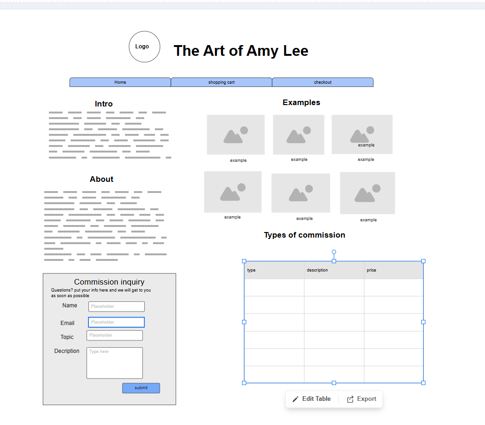
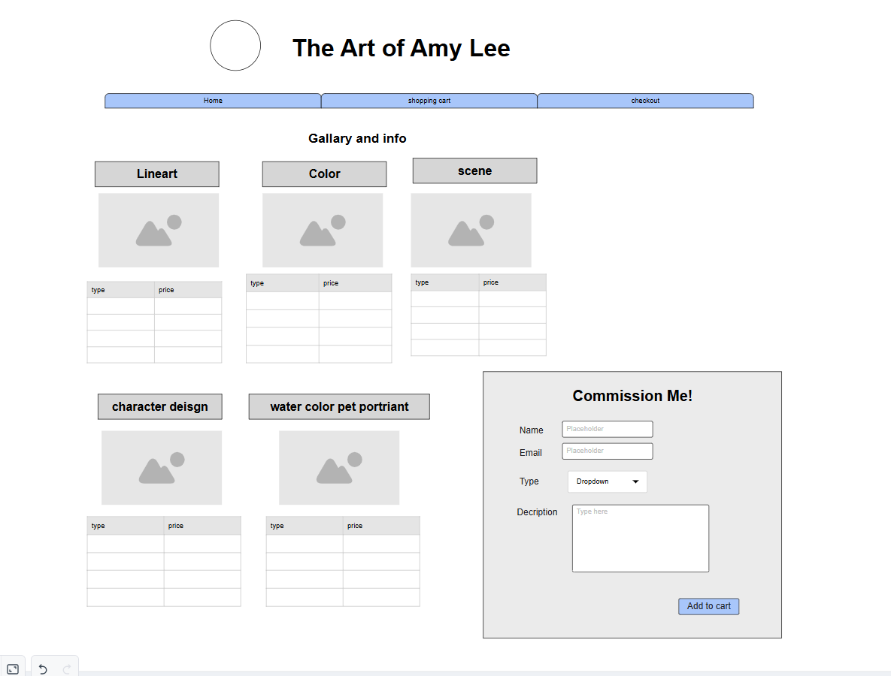

# Final project- Commison page

## Project Spec

For this project, I am aiming for  Artist commission page.  The general theme of this project is an Art commission page of my art. Specifically, an Animal art commission page, featuring different pieces of art I have done featuring animals, ranging from sketches to scenes. The target audience is animal lovers, pet owners, writers, and other artists. Really, anyone who wishes to get art of their pet or animal characters. There will be 3 pages. The first is the landing/index page. It would be an introductory page. It would have an introduction, about, prices, several examples, and how to navigate the webpage. There will be a navbar that links to the other webpages. The example art on this page will be static and set in the HTML. The data in this page will be a commission inquiry where they can put their name, email, type of commission, details, and submit button. Which will be sent to AWS. It will be for any person curious about a specific commission, like if it is possible without having to purchase anything. I'm not quite sure how exactly I will lay it out, but I am planning on looking at other artists portfolio websites for inspiration. 

 The second page will be a shopping cart. This page will retrieve data from AWS, where potential customers can choose what type of commission they want (headshot, watercolor pet portrait etc) and add it to the list with the prices. the customers can add a short description on each item on what they want. such as a watercolor if my dog, Walter etc, it will be the Post data in AWS. There will be a list with examples and their prices. The user will then select the type of commission they want via a drop-down menu. The user would also be able to write a short description of what they want on said commission. Sort of like the name portion in the previous lab.  Once the user puts their info, it will be sent to the checkout page. Where it gets the list of all the commission data. This will take them to the checkout page, which is the 3rd page. 

It will be similar to the inventory table from the previous lab. But in this case, it will be as follows. Type of commission, probably shortened, such as watercolor pet headshot to  W headshot, etc, Description ( via user input, price), and down below a delete button. then, down below would be the total price. Then the user will be able to add in "credit card info"  and their email, and basic info like first name and last name. this will send info to AWS, like the commission inquiry. It will be a mock credit card info data. Once the user clicks purchase. then there will be a pop-up that says "payment successful" or something like that. My goal is to get a better understanding of AWS, as I am pretty unfamiliar with how it sends and retrieves data in a more complicated way. I think it will also be useful in the long run because I do want to sell my art, and it will be a good start.

## Project Wireframe

 ### #The Index page brief overview. 

### The commission page overview

 

 ### The commission page overview

 

 ## Stretch Goals
  - allow user to select serval colors
  - allow users to put in images into their commison form
  - store commison form somewhere else after user checks out
  - maybe a search button for terms and services page
  

 ## sources used
   - wip will propery format soon

  
   https://stackoverflow.com/questions/20994768/how-to-reduce-length-of-uuid-generated-using-randomuuid
   
   https://developer.mozilla.org/en-US/docs/Web/CSS/Reference/Values/repeat
    
    https://freepngimg.com/png/25826-major-credit-card-logo-image

   https://www.flaticon.com/free-icon/shopping-cart_875985

   https://developer.mozilla.org/en-US/docs/Web/CSS/Reference/Values/fit-content

   https://stackoverflow.com/questions/2835140/how-do-i-link-to-part-of-a-page-hash

