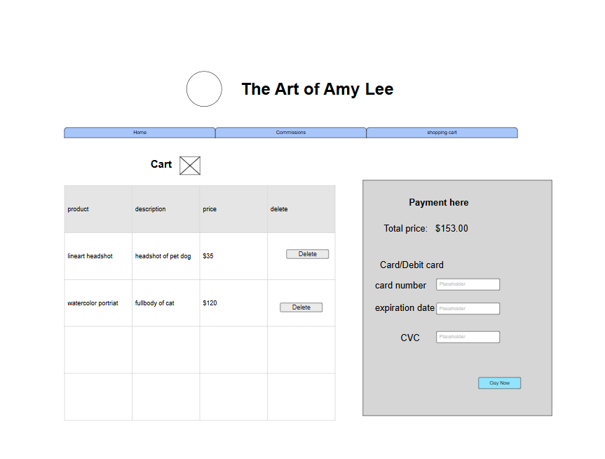

# Final project- Commison page

## Project overview

The general theme of this project is an Art commission page of my art. Specifically, an Animal art commission page, featuring different pieces of art I have done featuring animals, ranging from lineart to scenes to watercolor portraits.

Overall there are 4 pages in this site.The first is the landing/index page.  The second page is the Terms and conditions page, The third page is a commission page whre user can submit a commison form that will get sent to the shopping cart page. Finally the fourth and last page is the shopping cart page, where the user can preview their purchase,delete and enter their card details. Once they enter their card details, their commission data will be cleared from the AWS and front end.

This project will be built on CSS, javascript, HTML and data will be handled  through AWS services. Mainly Lambda, API Gateway, and DynamoDB. There it will store, retreive, and add new data.

## Target Audience

 The target audience is animal lovers, pet owners, writers, and other artists. Really, anyone who wishes to get art of their pet or animal characters. Other target audience could include
 bussiness owners who wishes to get stickers or art  for their business to sell for profit.


## Getting started

To get started, clone this repository and run the following commands:

```bash
npm install
```
This will install the necessary dependencies for the project.

## Navigating the website

The home page an introductory page. It would have an introduction, about, prices, several examples, and how to navigate the webpage. There will be a navbar that links to the other webpages. The example art on this page will be static and set in the HTML. Users will be able to submit a commmission inquiry form. There it will be send to and stored in AWS. you can see it via <a href = "https://us-east-2.console.aws.amazon.com/dynamodbv2/home?region=us-east-2#item-explorer?operation=SCAN&table=http-amy-lee-commission-inquiry"> dynamoDb table </a>

The second page will not have any AWS functionality. This page is preuly to give info on the terms 
and conditions of purchasing my art. Such as credit , use and the process. The page will have a list at the side where it will jump to the subject  for easy acess. User must click on the subject such as 
Getting started to do so. 

The third page is a more detailed overview of the types of commission it has to offer and the prices 
for each type. There is also a a decription. Scroll to the bottom to submitt a commison form that
will be stored <a href= "https://us-east-2.console.aws.amazon.com/dynamodbv2/home?region=us-east-2#item-explorer?operation=SCAN&table=http-amy-lee-cart"> here </a>.

It will then be send and displayed in the shopping cart page. However only the type, the price, the total price, and the description will be displayed. Each form submitted will have its own unique id
 randomly generated. USer then can delete any form one by one. User then could if they want add in their card details. It is a mock credit card set up where the only thing it would do is send data to 
 AWS . you can find it  <a href ="https://us-east-2.console.aws.amazon.com/dynamodbv2/home?region=us-east-2#item-explorer?operation=SCAN&table=http-amy-lee-credit-card"> here </a>. once the user checks out, it should clear the table.


## What sort of data will it manage?

Any user generated data will be stored and retreived from AWS services. All the AWS data manged is :
 - commission inquiry form sent by users to a DynamoDb table. 
 - commisson form sent by users
 -  card details to check out 

Other data stored through AWS is the flat rated commission prices stored in a AWS DynamoDB
table. That data is retreived by the commission form Lambda and displayed through there.


## Testing
  due to time I was unable to add any related tests to this project.

## Project Wireframe

 ### #The Index page brief overview. 


### The commission page overview


 ### The commission page overview



 ## Stretch Goals
  - allow user to select serval colors
  - allow users to put in images into their commison form
  - store commison form somewhere else after user checks out
  - maybe a search button for terms and services page
  


 ## sources used

   https://stackoverflow.com/questions/20994768/

   how-to-reduce-length-of-uuid-generated-using-randomuuid
   
   https://developer.mozilla.org/en-US/docs/Web/CSS/Reference/Values/repeat
    
    https://freepngimg.com/png/25826-major-credit-card-logo-image

   https://www.flaticon.com/free-icon/shopping-cart_875985

   https://developer.mozilla.org/en-US/docs/Web/CSS/Reference/Values/fit-content

   https://stackoverflow.com/questions/2835140/how-do-i-link-to-part-of-a-page-hash


